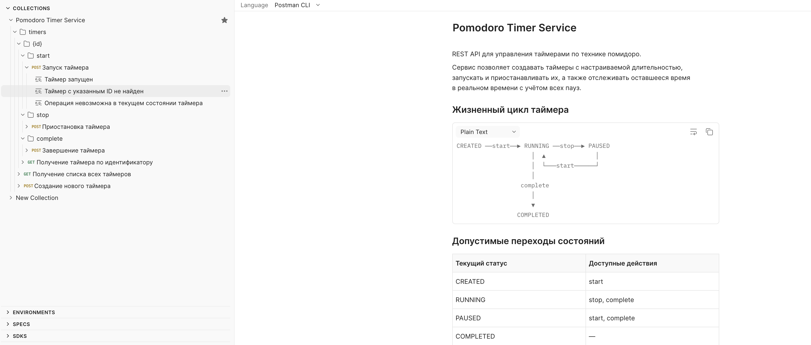
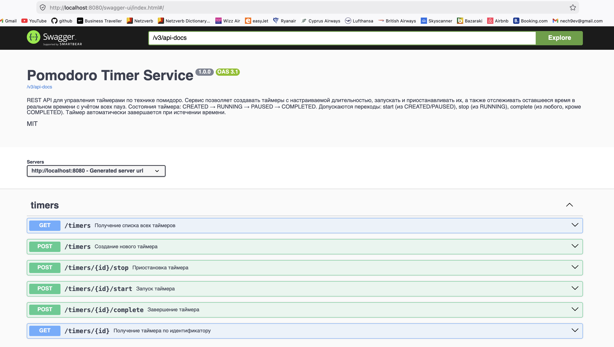

# Лабораторная работа 2 — Pomodoro Timer Service (API-first)

Сервис для работы с таймерами помидоро. API спроектировано по принципу api-first: сначала описывается спецификация в формате OpenAPI 3.0, а серверная часть генерируется на её основе.

**Автор:** Нечаев Игорь Сергеевич, 334772

**Postman:** [Коллекция запросов онлайн](https://restless-meadow-594566.postman.co/workspace/API-FIRST-Pomodoro~100a27af-243f-4f32-96a8-12c40767870c/collection/16244767-4e26dfad-6b85-441e-97c4-cb4143e873ac?action=share&source=copy-link&creator=16244767) | JSON-файл коллекции: [`Pomodoro Timer Service.postman_collection.json`](Pomodoro%20Timer%20Service.postman_collection.json)



## Что умеет сервис

- Создание таймеров с настраиваемой длительностью
- Запуск, пауза и возобновление таймера
- Завершение таймера
- Получение оставшегося времени в реальном времени (с учётом всех пауз)
- Автоматическое завершение таймера при истечении времени
- Просмотр списка всех таймеров

## Стек технологий

- Kotlin 2.1.10 + Spring Boot 3.5
- Spring Data JPA + PostgreSQL
- OpenAPI Generator (kotlin-spring)
- Docker Compose
- Maven

## Принцип API-first

Разработка ведётся от контракта — сперва формируется описание API, затем из него порождается код, и только потом пишется логика работы сервиса.

Преимущества такого подхода:

- Клиент и сервер работают по одному контракту, расхождения исключены
- Документация всегда соответствует реализации
- Рутинный код (контроллеры, DTO) создаётся автоматически

## Спецификация

Описание API находится в файле:

```
src/main/resources/openapi.yaml
```

Файл содержит:

- Перечень эндпоинтов и HTTP-методов
- Схемы тел запросов и ответов
- Описание моделей данных (`Timer`, `CreateTimerRequest`, `ErrorResponse`)
- Коды ответов для каждой операции

## Архитектура

В основе лежит **delegate pattern**: генератор создаёт контроллер и интерфейс делегата, а разработчик реализует только бизнес-логику.

```
openapi.yaml
    │
    ▼  (openapi-generator)
api/          ← сгенерированные контроллеры и интерфейсы
model/        ← сгенерированные DTO
    │
    ▼  (delegate pattern)
delegate/     ← реализация бизнес-логики (ручной код)
entity/       ← JPA-сущности (ручной код)
repository/   ← Spring Data репозитории (ручной код)
```

## Кодогенерация

За генерацию отвечает `openapi-generator-maven-plugin`, который срабатывает на фазе `generate-sources`.

```bash
# Запустить только генерацию
./mvnw generate-sources

# Пересобрать проект целиком
./mvnw clean compile
```

Плагин настроен на генератор `kotlin-spring` с опцией `delegatePattern=true`. На выходе получаются:

- `api/TimersApi.kt` — интерфейс с маппингами Spring MVC
- `api/TimersApiController.kt` — контроллер, пробрасывающий вызовы в делегат
- `api/TimersApiDelegate.kt` — интерфейс делегата (по умолчанию методы возвращают 501)
- `model/*.kt` — классы данных для запросов и ответов

Сгенерированные файлы попадают в `src/main/kotlin`. Ручной код (delegate, entity, repository) защищён от перезаписи через `.openapi-generator-ignore`.

## Эндпоинты

| Метод  | Путь                     | Описание                          |
|--------|--------------------------|-----------------------------------|
| GET    | `/timers`                | Список всех таймеров              |
| POST   | `/timers`                | Создать таймер                    |
| GET    | `/timers/{id}`           | Получить таймер по ID             |
| POST   | `/timers/{id}/start`     | Запустить таймер                  |
| POST   | `/timers/{id}/stop`      | Поставить на паузу                |
| POST   | `/timers/{id}/complete`  | Отметить как завершённый          |

### Состояния таймера

```
CREATED ──start──▶ RUNNING ──stop──▶ PAUSED
                     │  ▲              │
                     │  └───start──────┘
                     │
              complete / время вышло
                     │
                     ▼
                 COMPLETED
```

Если таймер находится в состоянии RUNNING и оставшееся время достигает 0, он автоматически переводится в COMPLETED при следующем обращении.

### Механизм отсчёта времени

Сервис хранит в БД момент последнего запуска (`started_at`) и суммарное время предыдущих сессий (`elapsed_seconds`). При каждом запросе оставшееся время вычисляется на лету:

- **RUNNING**: `remainingSeconds = duration * 60 - elapsedSeconds - (now - startedAt)`
- **PAUSED / CREATED**: `remainingSeconds = duration * 60 - elapsedSeconds`
- При паузе текущая сессия фиксируется в `elapsed_seconds`, а `started_at` сбрасывается
- Если `remainingSeconds` достигает 0, таймер автоматически завершается

## Запуск

### Требования

- Java 17+
- Maven (или встроенный `./mvnw`)
- Docker

### 1. Клонирование

```bash
git clone https://github.com/igor-nechaev/devtools.git
cd lab-2
```

### 2. Поднять базу данных

```bash
docker compose up -d
```

### 3. Собрать проект

Во время сборки Maven запустит кодогенерацию из OpenAPI-спецификации и скомпилирует проект.

```bash
./mvnw clean install
```

### 4. Запустить сервис

```bash
./mvnw spring-boot:run
```

Сервер стартует на http://localhost:8080

### 5. Swagger UI

Интерактивная документация: http://localhost:8080/swagger-ui/index.html



## Примеры использования

```bash
# Создать таймер на 25 минут
curl -X POST http://localhost:8080/timers \
  -H "Content-Type: application/json" \
  -d '{"name": "Работа", "durationMinutes": 25}'

# Запустить
curl -X POST http://localhost:8080/timers/1/start

# Узнать оставшееся время
curl http://localhost:8080/timers/1

# Пауза
curl -X POST http://localhost:8080/timers/1/stop

# Возобновить
curl -X POST http://localhost:8080/timers/1/start

# Завершить
curl -X POST http://localhost:8080/timers/1/complete
```
