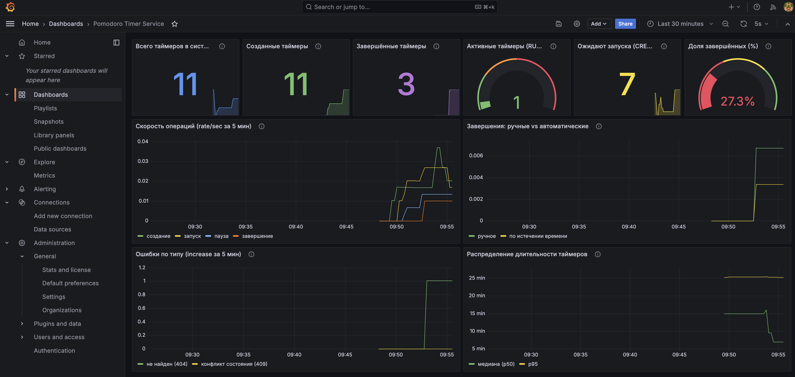
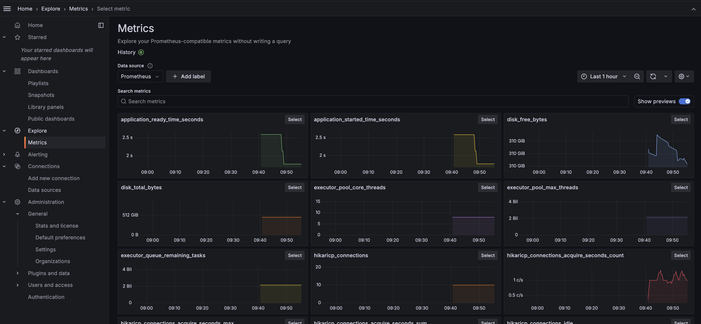

# Лабораторная работа 3 — Метрики (Prometheus + Grafana)

Расширение сервиса Pomodoro Timer из лабораторной работы 2: добавлен экспорт продуктовых метрик через Micrometer, сбор и хранение в Prometheus (TSDB), визуализация и PromQL-запросы в Grafana.

**Автор:** Нечаев Игорь Сергеевич, 334772

## Продуктовые метрики

Помимо стандартных метрик фреймворка (HTTP latency, JVM, connection pool), сервис экспортирует собственные метрики, отражающие бизнес-логику приложения:

| Метрика в Prometheus | Тип | Что показывает |
|----------------------|-----|----------------|
| `pomodoro_op_create_total` | Counter | Сколько таймеров создано |
| `pomodoro_op_start_total` | Counter | Сколько раз запускали таймеры |
| `pomodoro_op_stop_total` | Counter | Сколько раз ставили на паузу |
| `pomodoro_op_complete_total{reason="manual"}` | Counter | Завершены вручную (нажали complete) |
| `pomodoro_op_complete_total{reason="expired"}` | Counter | Завершены автоматически (время вышло) |
| `pomodoro_op_error_total{type="not_found"}` | Counter | Обращение к несуществующему таймеру |
| `pomodoro_op_error_total{type="conflict"}` | Counter | Попытка недопустимого перехода состояния |
| `pomodoro_gauge_running` | Gauge | Сколько таймеров сейчас запущено (RUNNING) |
| `pomodoro_gauge_pending` | Gauge | Сколько таймеров ожидают запуска (CREATED) |
| `pomodoro_gauge_all` | Gauge | Общее число таймеров в системе |
| `pomodoro_gauge_completion_rate` | Gauge | Доля завершённых от общего числа (0.0–1.0) |
| `pomodoro_timer_duration_minutes` | Histogram | Распределение длительности создаваемых таймеров |

### Где регистрируются

Все метрики регистрируются через `MeterRegistry` в `TimersApiDelegateImpl.kt`. Counters инкрементируются при каждой операции, Gauges вычисляются из БД при каждом scrape.

## PromQL-запросы

### Продуктовые запросы на дашборде

| Панель | PromQL-запрос | Зачем нужен |
|--------|---------------|-------------|
| Доля завершённых (%) | `pomodoro_gauge_completion_rate * 100` | Ключевая метрика продуктивности — сколько % таймеров доводят до конца |
| Активные таймеры | `pomodoro_gauge_running` | Текущая нагрузка — сколько пользователей работают прямо сейчас |
| Скорость операций | `rate(pomodoro_op_create_total[5m])` | Динамика активности пользователей во времени |
| Ручные vs авто | `rate(pomodoro_op_complete_total{reason="manual"}[5m])` vs `{reason="expired"}` | Если автозавершений больше — пользователи забрасывают таймеры |
| Ошибки | `increase(pomodoro_op_error_total[5m])` | Абсолютное число ошибок за 5 мин, разбивка по типу (404/409) |
| Распределение длительности | `histogram_quantile(0.5, rate(pomodoro_timer_duration_minutes_bucket[5m]))` | Медиана длительности — короткие перерывы или полные помидоро? |

### Запросы в Grafana Explore

Ниже — примеры PromQL-запросов, выполненных в Grafana Explore (меню → Explore → Prometheus).

**Сколько таймеров создано за последний час:**

```promql
increase(pomodoro_op_create_total[1h])
```


**Отношение пауз к запускам** — показывает, как часто пользователи прерывают работу (1.0 = каждый запуск заканчивается паузой):

```promql
rate(pomodoro_op_stop_total[5m]) / rate(pomodoro_op_start_total[5m])
```


**Процент автозавершений от всех завершений** — если значение высокое, пользователи не нажимают complete, а просто ждут истечения:

```promql
increase(pomodoro_op_complete_total{reason="expired"}[1h])
  / ignoring(reason) sum without(reason)(increase(pomodoro_op_complete_total[1h])) * 100
```


**Среднее время ответа API на эндпоинтах таймеров (мс)** — отношение суммарного времени к числу запросов:

```promql
rate(http_server_requests_seconds_sum{uri=~"/timers.*"}[5m])
  / rate(http_server_requests_seconds_count{uri=~"/timers.*"}[5m]) * 1000
```


**Количество ошибок в процентах от всех запросов** — показывает error rate сервиса:

```promql
sum(rate(pomodoro_op_error_total[5m]))
  / sum(rate(http_server_requests_seconds_count{uri=~"/timers.*"}[5m])) * 100
```


## Grafana-дашборд

Дашборд `Pomodoro Timer Service` подгружается автоматически при старте Grafana (provisioning) и содержит 10 панелей:

**Верхний ряд (состояние системы):**
- Всего таймеров — общее число в БД
- Созданные — counter с момента старта
- Завершённые — сумма ручных и автоматических
- Активные — gauge, текущие RUNNING
- Ожидают запуска — gauge, CREATED
- Доля завершённых (%) — ключевая продуктовая метрика

**Графики (динамика):**
- Скорость операций (rate/sec) — создание, запуск, пауза, завершение
- Ручные vs автоматические завершения — помогает понять поведение пользователей
- Ошибки по типу — not_found (404) и conflict (409)
- Распределение длительности — медиана и p95 по гистограмме

Скриншоты дашборда — см. раздел [Скриншоты](#скриншоты).

## Инфраструктура

```
docker-compose.yml
├── postgres:17        :5432   БД приложения
├── prom/prometheus     :9090   Сбор метрик (scrape каждые 5 сек)
└── grafana/grafana     :3000   Дашборды (admin/admin)

prometheus.yml                  Конфигурация scrape → host.docker.internal:8080/actuator/prometheus
grafana/provisioning/
├── datasources/prometheus.yml  Автоматическое подключение Prometheus
└── dashboards/
    ├── dashboards.yml          Провайдер дашбордов
    └── pomodoro.json           Дашборд с 10 панелями
```

## Стек технологий

- Kotlin 2.1.10 + Spring Boot 3.5
- Spring Boot Actuator + Micrometer
- micrometer-registry-prometheus
- Prometheus (TSDB, PromQL)
- Grafana (визуализация, provisioning)
- Spring Data JPA + PostgreSQL
- OpenAPI Generator (kotlin-spring)
- Docker Compose
- Maven

## Запуск

### Требования

- Java 17+
- Maven (или встроенный `./mvnw`)
- Docker

### 1. Поднять инфраструктуру

```bash
cd lab-3
docker compose up -d
```

Запустятся PostgreSQL, Prometheus и Grafana.

### 2. Собрать и запустить приложение

```bash
./mvnw clean install
./mvnw spring-boot:run
```

### 3. Проверить

| Что | URL |
|-----|-----|
| Приложение | http://localhost:8080 |
| Swagger UI | http://localhost:8080/swagger-ui/index.html |
| Метрики (raw) | http://localhost:8080/actuator/prometheus |
| Prometheus | http://localhost:9090 |
| Grafana | http://localhost:3000 (admin/admin) |

### 4. Посмотреть дашборд

Откройте Grafana → Dashboards → `Pomodoro Timer Service`. Дашборд загружен автоматически.

Создайте несколько таймеров и поработайте с ними, чтобы графики заполнились данными.

## Скриншоты

### Продуктовые метрики

Дашборд с кастомными метриками бизнес-логики сервиса. Здесь отображаются данные, которые не предоставляет фреймворк из коробки — они регистрируются вручную через `MeterRegistry` в `TimersApiDelegateImpl.kt`:

- **Всего таймеров / Созданные / Завершённые** — абсолютные счётчики, позволяют оценить общий объём использования сервиса
- **Активные (RUNNING)** — gauge, показывает текущую нагрузку в реальном времени
- **Ожидают запуска (CREATED)** — если число растёт, пользователи создают таймеры, но не запускают
- **Доля завершённых (%)** — ключевая продуктовая метрика: какой процент таймеров доводят до конца
- **Скорость операций** — `rate()` по каждому типу операции, видны всплески активности
- **Ручные vs автоматические завершения** — если автозавершений больше, пользователи забрасывают таймеры не дожидаясь окончания
- **Ошибки по типу** — 404 (not_found) и 409 (conflict), помогает отловить некорректное использование API
- **Распределение длительности** — медиана и p95, показывает какие таймеры создают чаще (5 мин перерывы или 25 мин помидоро)



### Технические метрики фреймворка

Стандартные метрики, которые Spring Boot Actuator экспортирует автоматически. Они не требуют ручной регистрации и дают общую картину здоровья сервиса:

- **HTTP-запросы** (`http_server_requests_seconds`) — latency, throughput, коды ответов по эндпоинтам
- **JVM** — использование heap/non-heap памяти, GC паузы, количество потоков
- **Hikari Connection Pool** — активные/ожидающие соединения к PostgreSQL
- **System** — CPU usage, загрузка системы


