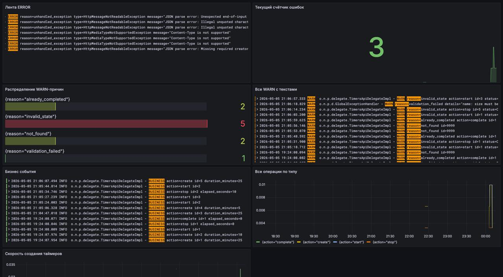
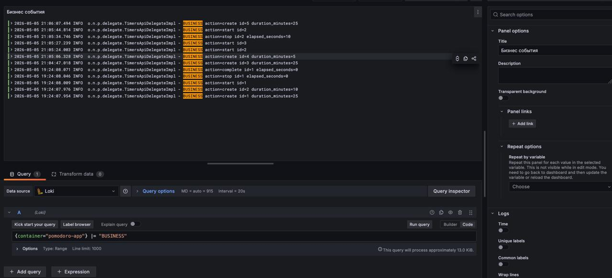
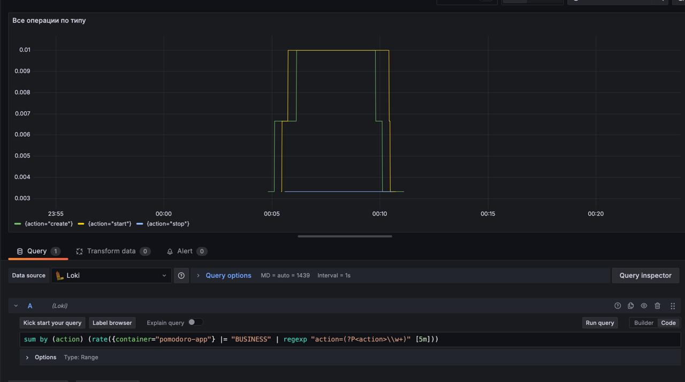
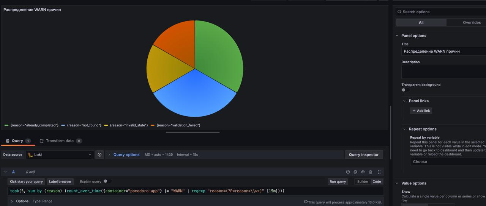
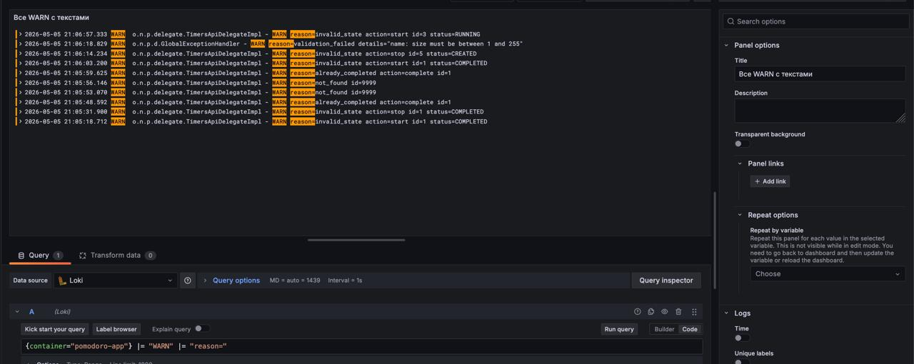
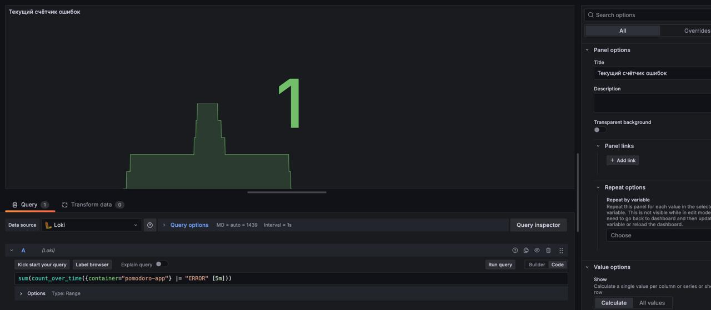
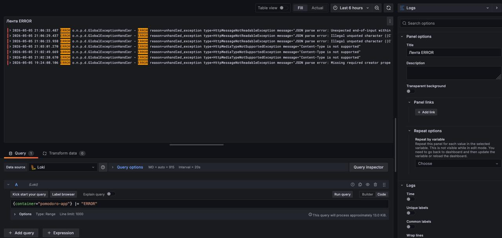

# Журналирование

## доставка логов

В сервисе используется SLF4J/Logback и единственный аппендер пишет в stdout. Внутри Docker stdout каждого
контейнера попадает в JSON-файл на хосте (`/var/lib/docker/containers/<id>/<id>-json.log`), и это даёт точку
сбора.

Поверх этого стоит **Grafana Alloy** (наследник Promtail). Он подключается к docker-сокету (`/var/run/docker.sock`),
обнаруживает контейнеры через `discovery.docker`, читает их stdout и отправляет в **Loki** по HTTP. На лейблы попадают
имя контейнера, имя сервиса в compose и поток (`stdout`/`stderr`) - этого достаточно, чтобы фильтровать в LogQL.

**Loki** хранит логи в filesystem-storage и индексирует только по меткам; тело сообщения не индексируется, а сжимается в
чанки. Для нашей лабы поднята single-instance конфигурация без шардирования и репликации (`replication_factor: 1`)

**Grafana** подключена к Loki через provisioning (`grafana/provisioning/datasources/prometheus.yml`) и используется для
просмотра логов и построения графиков по ним через язык запросов LogQL.

## Уровни и формат сообщений

В коде разнесены три уровня:

- `INFO`  бизнес-события, которые отражают изменения состояния таймеров (`create`, `start`, `stop`, `complete`,
  `auto_complete`). Сообщение начинается с маркера `BUSINESS` и продолжается парами `action=… id=…`.
- `WARN`  некорректные пользовательские сценарии, которые сервис обработал штатно: попытка сменить состояние, не
  допускающее перехода; обращение к несуществующему таймеру; ошибка валидации входного запроса. Сообщение содержит
  `reason=…`.
- `ERROR`  непредвиденные исключения, перехваченные глобальным обработчиком

## Запросы LogQL

### Все бизнес-события сервиса

```
{container="pomodoro-app"} |= "BUSINESS"
```

### Создание таймеров с течением времени

```
sum(rate({container="pomodoro-app"} |= "action=create" [5m]))
```

### Распределение типов отказов (top-N)

```
topk(5, sum by (action) (count_over_time({container="pomodoro-app"} |= "WARN" |= "reason=" [15m])))
```

### Тексты предупреждений

```
{container="pomodoro-app"} |= "WARN" |= "reason="
```

### Ошибки ERROR

```
{container="pomodoro-app"} |= "ERROR"
```

### События по конкретному id таймера

```
{container="pomodoro-app"} |= "id=42"
```

## Запуск

```bash
cd lab-5
./mvnw clean package
docker compose up -d --build
```

- App: http://localhost:8080
- Grafana: http://localhost:3000
- Prometheus: http://localhost:9090
- Loki API: http://localhost:3100
- Alloy UI: http://localhost:12345

## Скриншоты

### Дашборд логов целиком

Сводный дашборд по Loki: бизнес-события, распределение типов операций, WARN-причины, счётчик и лента ERROR.



### Лента бизнес-событий (`BUSINESS`)

Панель **Logs** по запросу `{container="pomodoro-app"} |= "BUSINESS"`. Здесь видно каждый переход состояния таймера
`action=create|start|stop|complete|auto_complete`



### Распределение типов бизнес-операций

`count_over_time` по `BUSINESS` с разбором `action=` через `regexp`. Полезно, чтобы понять, какие операции
доминируют (например, много `create`, но мало `complete`  пользователи создают и забрасывают).



### Распределение причин WARN

`topk(5, sum by (reason) ...)` по WARN-сообщениям. Видно, какие пользовательские ошибки преобладают



### Лента WARN

Тексты всех WARN-сообщений с подробностями (`reason=…`, `details=…`)



### Счётчик ERROR

Stat-панель с `sum(count_over_time({container="pomodoro-app"} |= "ERROR" [5m]))`



### Лента ERROR

Тексты ошибок уровня ERROR со стектрейсами


