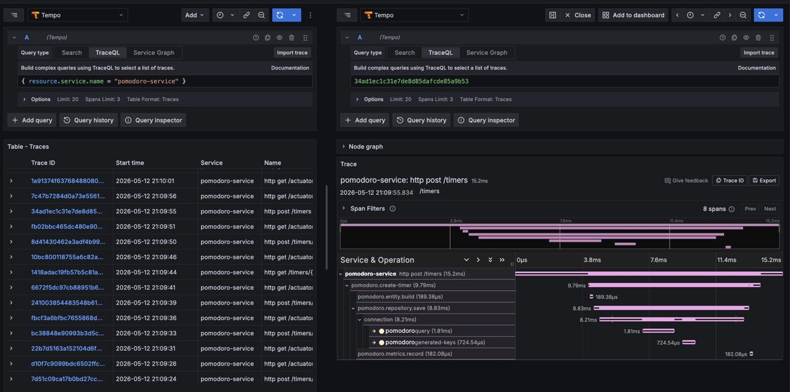
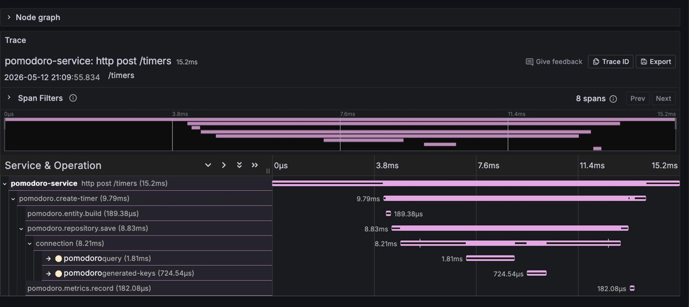
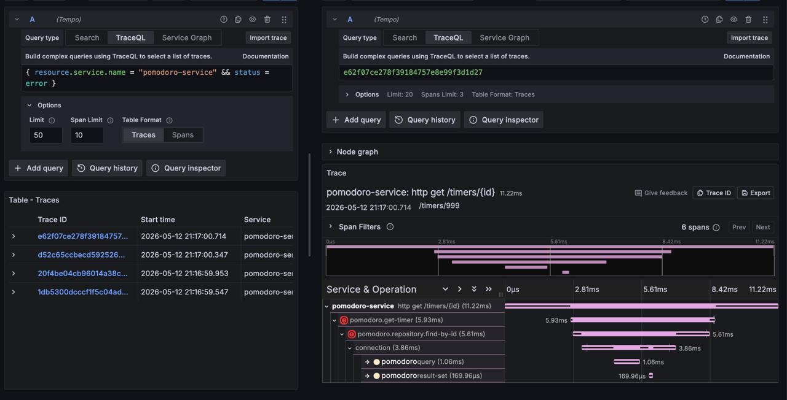
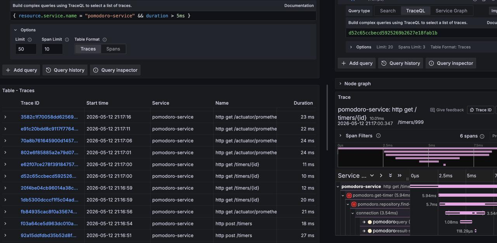
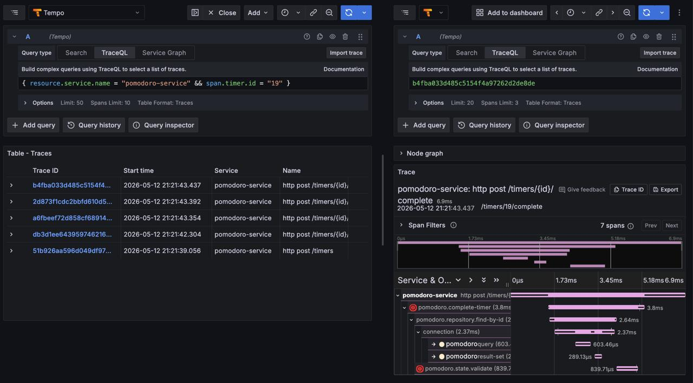
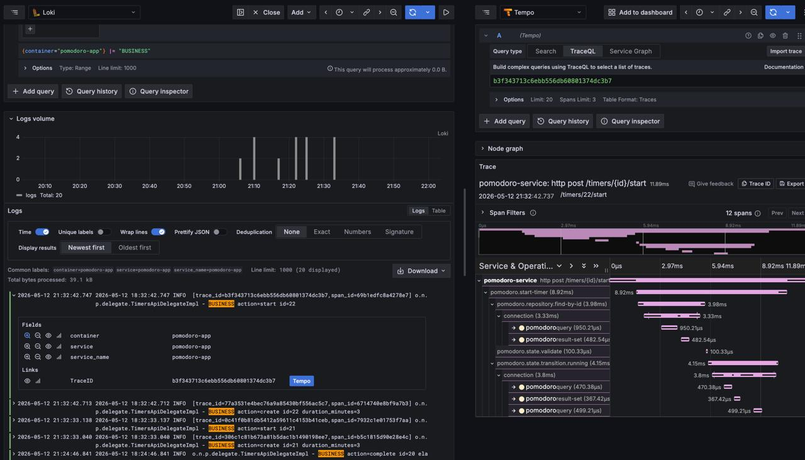

# Тассировка

## Схема работы

```
pomodoro-app (Spring Boot + OTel SDK)
OTLP/HTTP :4318 - Grafana Tempo - Grafana Explore (TraceQL)
```

Каждый входящий HTTP запрос порождает корневой спан. Поверх этого бизнес-операции вручную обёрнуты в дочерние
именованные спаны через Micrometer `Observation` API; JDBC-запросы к БД трейсируются автоматически через
`datasource-micrometer`. Итог дерево из спанов на каждый запрос.

## Настройка

```yaml
management:
  tracing:
    sampling:
      probability: 1.0
  otlp:
    tracing:
      endpoint: http://tempo:4318/v1/traces
    metrics:
      export:
        enabled: false
```

## TraceQL-запросы

### Полный список трейсов сервиса

```traceql
{ resource.service.name = "pomodoro-service" }
```



### Дерево спанов при создании таймера

```traceql
{ resource.service.name = "pomodoro-service" && name = "pomodoro.create-timer" }
```



### Запросы, завершившиеся ошибкой

```traceql
{ resource.service.name = "pomodoro-service" && status = error }
```



### Запросы дольше 5 мс

```traceql
{ resource.service.name = "pomodoro-service" && duration > 5ms }
```



### История операций над одним таймером

```traceql
{ resource.service.name = "pomodoro-service" && span.timer.id = "1" }
```



### Переход из лога в трейс

Формат лога включает `trace_id=<hex>` - Grafana показывает ссылку на соответствующий трейс в Tempo прямо из строки лога.


